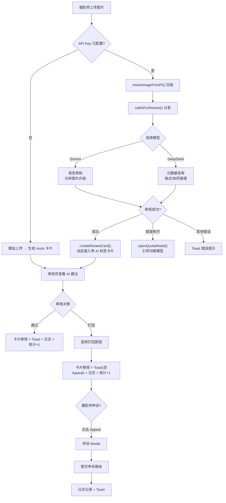

## 1. 产品概述

本项目是一个为现代摄影平台设计的**供稿审核后台 MVP（最小可行性产品）**。

核心场景：随着 UGC（用户生成内容）的爆发，摄影平台每天接收海量的图片供稿。传统纯人工审核面临**效率低下、风险漏判、标准不一**三大痛点。本系统引入"AI 机审 + 人工复核"的工作流，让 AI 拦截 90% 的低质与违规稿件，让人工只专注于 10% 的边缘争议内容（Edge Cases）。

采用深色模式（Dark Mode），界面设计专业、克制，符合高级影像管理软件的调性。

## 2. 核心指标设计

| 指标 | 目标值 | 说明 |
|------|--------|------|
| **机审召回率** (Recall Rate) | > 99.2% | 针对"政治敏感"、"版权争议"等高风险内容，模型策略偏向"宁可错杀，不可放过" |
| **机审准确率** (Accuracy Rate) | > 85.0% | 针对"画面模糊"、"噪点过高"等低质量废片，要求高准确率，直接系统打回 |
| **平均出审时效** | < 1.2s | 从上传到 AI 返回审核建议的端到端时间 |

## 3. 用户角色

| 角色 | 核心权限 |
|------|----------|
| **摄影师** | 拖拽/点击上传图片至供稿池；被打回后提交申诉理由 |
| **审核员** | 查看 AI 机审建议；执行"通过"（Approve）或"打回"（Reject）操作；查看审核日志与业务看板 |
| **系统管理员** | 配置 API Key（Gemini / DeepSeek）；切换 AI 模型；处理额度耗尽场景 |

## 4. 功能模块

### 4.1 上传区
- 美观的拖拽上传框，支持虚线边框交互与状态变化
- 隐藏 `<input type="file">` 支持点击选择真实图片（`accept="image/*"`）
- **双模式运行**：
  - **模拟模式**（未配置 API Key）：展示假上传动画，自动生成 mock 卡片
  - **AI 模式**（已配置 API Key）：真实图片 → Base64 压缩编码 → AI 审核 → 动态创建带评分的审核卡片

### 4.2 审核工作台
- 卡片网格布局展示待审图片，每张卡片包含：
  - 图片缩略图（暗角叠加，凸显文字信息）
  - 摄影师 ID + 上传时间
  - **AI 机审标签**：建议通过（绿）/ 需人工复核（黄）/ 建议打回（红）
  - **AI 评分徽章**：右上角数字评分，hover 展示详细审核理由
- 悬浮操作按钮组：Approve（暗绿色）/ Reject（暗红色）
- 审核后卡片滑出动画，数据写入 localStorage 防止刷新复现

### 4.3 打回原因菜单
- 点击 Reject 后弹出细分子菜单：
  - **版权争议** — 疑似盗图、水印、第三方转载
  - **画面模糊** — 对焦失败、运动模糊、分辨率不足
  - **政治敏感** — 违规旗帜、敏感符号、不当内容
- 选择原因后执行打回并弹出附带 Appeal 按钮的 Toast

### 4.4 业务实时看板
- 侧边栏展示当日核心运营数据：
  - **今日已审**（动态递增，localStorage 持久化）
  - **平均出审时效**（固定 1.2s，代表 AI 辅助后的效率提升）
  - **机审召回率**（固定 99.2%，代表模型安全兜底能力）
- 副标题："业务实时看板"

### 4.5 审核日志
- 侧边栏独立面板，实时追加带时间戳的操作记录
- 日志类型：
  - `✅ 通过` — 审核员确认通过
  - `❌ 打回(原因)` — 审核员打回并附带原因
  - `📩 申诉提交` — 摄影师提交申诉
- 数据存入 localStorage，页面刷新不丢失

### 4.6 摄影师申诉闭环
- 打回 Toast 持续 6 秒（长于普通 Toast），附带醒目的 "Appeal →" 按钮
- 点击 Appeal → 弹出申诉浮层 Modal，包含：
  - 被打回图片的信息摘要
  - 申诉理由 `<textarea>` 输入框
- 提交申诉 → 关闭 Modal → 写入审核日志 → Toast 提示"申诉已提交"

### 4.7 AI 模型配置
- **API Key 配置横幅**（琥珀色）：顶部提示输入 API Key
  - 模型选择器 `<select>`：Gemini 2.0 Flash / DeepSeek Chat
  - Key 输入框 + "启用 AI" 按钮
  - Key 存入 localStorage，刷新自动回填
- **连接状态横幅**（绿色）：显示"已连接 - {模型名称}"
- **额度耗尽弹窗**：自动检测 HTTP 402/429 + 关键词，弹出琥珀色 UI
  - 提示当前模型额度不足
  - 提供一键切换至另一模型按钮
  - 也可手动关闭继续使用当前模型

### 4.8 双模型 AI 审核

| 模型 | 审核方式 | 能力 | 适用场景 |
|------|---------|------|----------|
| **Gemini 2.0 Flash** | 视觉审核 | 原生支持图片 Base64 输入，分析画面内容 | 安全、质量、版权全维度审核 |
| **DeepSeek Chat** | 元数据盲审 | 文本推理，基于格式/体积/文件名研判 | 格式分析、版权推断、文件质量评估 |

- DeepSeek 盲审规则：PNG < 50KB → 疑似截图盗图；RAW/TIFF > 5MB → 专业级；JPEG > 2MB → 优质投稿
- 统一分发器 `callAIForReview()` 根据当前 provider 自动路由
- 审核结果统一格式：`{ is_safe, score, reason }`

## 5. 核心流程

## 6. 用户界面设计

### 6.1 设计风格
- **主色调与背景**：深色模式，背景 `#0a0a0a` 至 `#111827`，层次分明的大留白
- **按钮与交互**：克制的高级感，微发光/透明度变化。"通过"用暗绿色，"打回"用暗红色
- **卡片设计**：图片暗角叠加，凸显白色文字信息（摄影师 ID、上传时间），悬浮展示操作按钮组
- **字体**：干净无衬线的专业字体（系统默认无衬线字体）
- **动画**：Toast 滑入/滑出、卡片 fadeOut、下拉菜单 fadeIn、Modal scale 弹入

### 6.2 新增 UI 组件

| 组件 | UI 特征 | 交互 |
|------|--------|------|
| AI 标签 | 卡片左上角彩色 badges | 建议通过（绿边）/ 需复核（黄边）/ 建议打回（红边） |
| AI 评分徽章 | 卡片右上角圆形数字 | hover 弹出 tooltip 展示详细审核理由 |
| 打回原因菜单 | Reject 按钮旁弹出的深色菜单 | 3 个选项，点击后确认打回 |
| 申诉 Modal | 居中浮层，深色半透明遮罩 | 包含图片信息和 textarea，支持提交和取消 |
| 审核日志 | 侧边栏滚动面板 | 实时追加条目，时间戳 + 操作类型 + 详情 |
| API Key 横幅 | 顶部固定条 | 琥珀色（未配置）/ 绿色（已连接），含 select 和 input |
| 额度耗尽弹窗 | 居中 Modal，琥珀色 | 电池图标 + 提示文字 + 切换按钮 |

### 6.3 响应式设计
优先支持桌面端（管理后台场景），宽屏下布局舒展。移动端可做适当的单列折叠自适应。

## 7. 数据持久化策略

| 存储 Key | 数据类型 | 用途 |
|----------|---------|------|
| `photoAudit_reviewedCards` | Array | 已审卡片 ID，防止刷新复现 |
| `photoAudit_reviewedToday` | Number | 今日审核计数 |
| `photoAudit_auditLogs` | Array | 审核日志（时间戳 + 操作类型 + 详情） |
| `photoAudit_apiKey` | String | 当前 API Key |
| `photoAudit_provider` | String | 当前模型选择（gemini/deepseek） |
