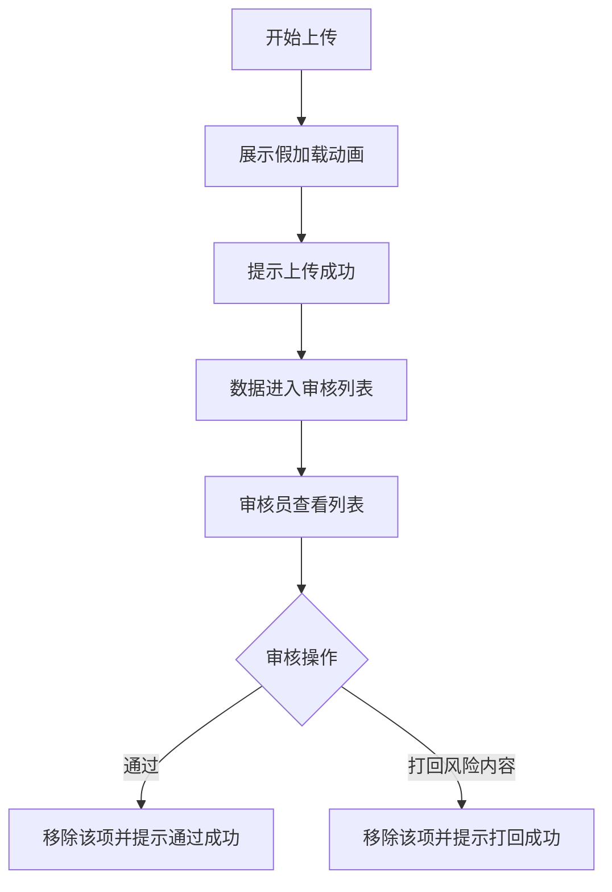

## 1. 产品概述
本项目是一个摄影平台的供稿审核后台 MVP（最小可行性产品）的静态交互 Demo。
- 主要用于模拟摄影师上传图片以及审核人员对稿件进行审核的工作流。
- 采用深色模式（Dark Mode），界面设计专业、克制，符合高级影像管理软件的调性。

## 2. 核心功能

### 2.1 用户角色
| 角色 | 核心权限 |
|------|----------|
| 摄影师 | 模拟拖拽上传图片（展示假加载动画及成功提示） |
| 审核员 | 查看待审核稿件，执行“通过”或“打回风险内容”操作 |

### 2.2 功能模块
1. **上传区**：美观的拖拽上传框，模拟上传进度及成功反馈。
2. **审核工作台**：列表或卡片视图展示待审数据，支持通过/打回操作，附带全局消息提示。

### 2.3 页面详情
| 页面名称 | 模块名称 | 功能描述 |
|-----------|-------------|---------------------|
| 审核后台首页 | 上传区 | 拖拽上传框，点击或拖拽模拟上传图片，展示加载动画，完成后提示成功并模拟数据进入待审 |
| 审核后台首页 | 审核工作台 | 列表/卡片展示3条假数据（略缩图、摄影师ID、上传时间）。包含“通过”和“打回风险内容”按钮，点击后数据消失并弹出全局提示 |

## 3. 核心流程

## 4. 用户界面设计
### 4.1 设计风格
- 主色调与背景：深色模式（Dark Mode），背景色使用深灰或纯黑（如 `#0a0a0a` 或 `#111827`）。
- 按钮与交互状态：克制的高级感，操作按钮使用微小的发光或透明度变化，避免大块高饱和度颜色。“通过”使用沉稳的暗绿色，“打回”使用暗红色。
- 字体：使用干净无衬线的专业字体（如 Inter 或系统默认无衬线字体）。
- 布局风格：模块化的卡片式布局，大留白，层次分明，呈现影像软件的专业感。

### 4.2 页面设计概览
| 页面名称 | 模块名称 | UI 元素与交互 |
|-----------|-------------|-------------|
| 审核后台首页 | 上传区 | 虚线边框，深色底纹，拖拽状态变化，加载进度条/Spinner，成功态图标 |
| 审核后台首页 | 审核工作台 | 网格排列的图片卡片，图片包含暗角以凸显上方白色文字（摄影师ID和时间）。悬浮时显示操作按钮组 |
| 全局 | Toast 提示 | 屏幕顶部居中或右下角弹出的深色卡片，带微弱阴影和色彩标识状态 |

### 4.3 响应式设计
优先支持桌面端（由于是管理后台），确保宽屏下布局舒展。移动端可做适当的单列折叠自适应。
