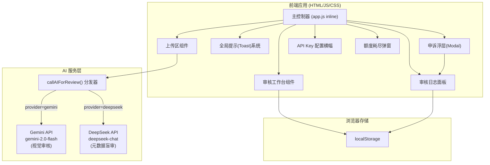
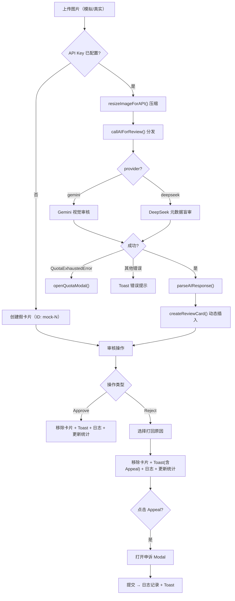

## 1. 架构设计



## 2. 技术栈

- **前端**：原生 HTML5 + Tailwind CSS (CDN) + 原生 JavaScript (ES6+)
- **图标库**：Lucide Icons (SVG, CDN)
- **AI 服务**：
  - Google Gemini 2.0 Flash — 原生视觉能力，支持 `inline_data` Base64 图片输入
  - DeepSeek Chat — 纯文本模型，通过文件元数据（格式、体积）模拟盲审推理
- **持久化**：浏览器 `localStorage`（无需后端）
- **运行方式**：零依赖，浏览器直接打开 `index.html`

## 3. 组件架构

### 3.1 上传区组件
- 虚线边框拖拽区，支持 `dragenter` / `dragover` / `dragleave` / `drop` 事件
- 隐藏 `<input type="file">` 支持点击选择真实图片
- **双模式**：
  - 未配置 API Key → 模拟假上传（loading 动画 + 假卡片）
  - 已配置 API Key → `resizeImageForAPI()` 压缩 → Base64 编码 → AI 审核 → `createReviewCard()` 动态插入

### 3.2 审核工作台组件
- 卡片网格布局，每张卡片包含：缩略图、摄影师 ID、上传时间、AI 机审标签、评分徽章
- 操作按钮组：Approve（通过）/ Reject（打回）
- **Reject 子菜单**：版权争议 / 画面模糊 / 政治敏感
- 审核后卡片滑出动画，数据存入 localStorage

### 3.3 Toast 提示系统
- 屏幕顶部居中弹出，深色半透明背景
- 状态色彩：通过（绿）、打回（红）、上传（蓝）
- 打回 Toast 持续 6 秒，附带 "Appeal" 按钮入口
- CSS `@keyframes` 滑入/滑出动画

### 3.4 审核日志面板
- 侧边栏独立面板，实时追加条目
- 日志格式：`[时间戳] 操作类型 - 摄影师ID - 详情`
- 操作类型：`✅ 通过` / `❌ 打回（版权争议/画面模糊/政治敏感）` / `📩 申诉提交`
- 数据存储在 `localStorage`，页面刷新不丢失

### 3.5 申诉浮层 (Appeal Modal)
- 打回 Toast → 点击 "Appeal" → 弹出 Modal
- 包含：图片信息摘要、申诉理由 `<textarea>`
- 提交后：关闭 Modal → 写入审核日志 → Toast 提示申诉已提交

### 3.6 API Key 配置横幅
- 琥珀色提示横幅，包含 model 选择器 `<select>` 和 API Key `<input>`
- 支持 Gemini / DeepSeek 切换
- Key 存入 `localStorage`，页面刷新自动回填
- 绿色确认横幅显示已连接状态（含当前模型名称）

### 3.7 额度耗尽弹窗 (Quota Modal)
- 自动检测 HTTP 402/429 及 API 返回的 quota/billing 关键词
- 触发时弹出琥珀色弹窗，提示当前模型额度不足
- 提供一键切换至另一模型的按钮（`switchProviderFromQuota()`）

## 4. AI 服务层设计

### 4.1 分发器模式
```
callAIForReview(imageBase64, fileName, fileSize) → 根据 currentProvider 路由
  ├── provider=gemini  → callGeminiForReview()
  └── provider=deepseek → callDeepseekForReview()
```

### 4.2 Gemini 视觉审核 (callGeminiForReview)
- 端点：`https://generativelanguage.googleapis.com/v1beta/models/gemini-2.0-flash:generateContent`
- 输入格式：`{ inlineData: { mimeType, data: base64 } }`
- Prompt 要求返回 JSON：`{ is_safe, score, reason }`
- 图片预处理：`resizeImageForAPI()` 缩放至最大 1024px + JPEG 0.8 质量

### 4.3 DeepSeek 盲审 (callDeepseekForReview)
- 端点：`https://api.deepseek.com/chat/completions`
- 输入格式：纯文本，不包含 `image_url`（`deepseek-chat` 不支持视觉）
- 将文件格式（JPEG/PNG/RAW 等）和体积（KB/MB）转化为结构化提示词
- **盲审规则矩阵**：

| 格式 | 文件大小 | 判定倾向 | 分数区间 |
|------|---------|---------|----------|
| PNG | < 50KB | is_safe=false，疑似截图/盗图 | 30-45 |
| PNG | 50-200KB | 边缘可疑，建议人工复核 | 50-65 |
| RAW/TIFF | > 5MB | 专业级原始文件 | 85-95 |
| JPEG | > 2MB | 优质投稿 | 75-90 |
| JPEG | < 200KB | 严重压缩，画质损失 | 45-65 |
| WEBP/GIF | 任意 | 10-20% 概率标记为"疑似第三方转载" | 55-75 |

### 4.4 额度耗尽检测
```javascript
class QuotaExhaustedError extends Error {}
detectQuotaError(response) // 检查 HTTP status 和错误消息关键词
```

- 检测 `402 Payment Required` / `429 Too Many Requests`
- 检测关键词：`quota` / `billing` / `insufficient_quota` / `rate limit`
- 匹配时抛出 `QuotaExhaustedError`，由 `processRealUpload()` catch 块统一处理

### 4.5 图片预处理 (resizeImageForAPI)
- 输入：`File` 对象
- 流程：`FileReader` → `Image` → `Canvas` → `toBlob`(JPEG, 0.8)
- 最大尺寸：1024px（长边）
- 输出：`{ base64, resizedBlob }`

## 5. localStorage 数据模型

```javascript
// Key: photoAudit_reviewedCards
// 已审卡片 ID 集合，防止刷新后重新出现
["card-1", "card-2", /* ... */]

// Key: photoAudit_reviewedToday
// 今日审核计数（Approve + Reject）
128

// Key: photoAudit_auditLogs
// 审核日志数组
[
  { time: "10:23:45", type: "approve", photographer: "@alex_photo", detail: "AI评分 85" },
  { time: "10:24:12", type: "reject", photographer: "@jordan_shots", reason: "版权争议", detail: "AI评分 42" },
  { time: "10:25:30", type: "appeal", photographer: "@jordan_shots", detail: "申诉理由: 本人原创作品，附有RAW文件" },
  // ...
]

// Key: photoAudit_apiKey
// 当前 API Key
"sk-xxxx"

// Key: photoAudit_provider
// 当前选择的模型
"gemini" | "deepseek"
```

## 6. 状态流转



## 7. 目录结构

```
photo-audit-demo/
├── index.html                # 主页面（全部 HTML/CSS/JS 逻辑）
├── README.md                 # 项目说明
└── .trae/
    └── documents/
        ├── prd.md            # 产品需求文档
        └── tech-arch.md      # 技术架构文档（本文件）
```
