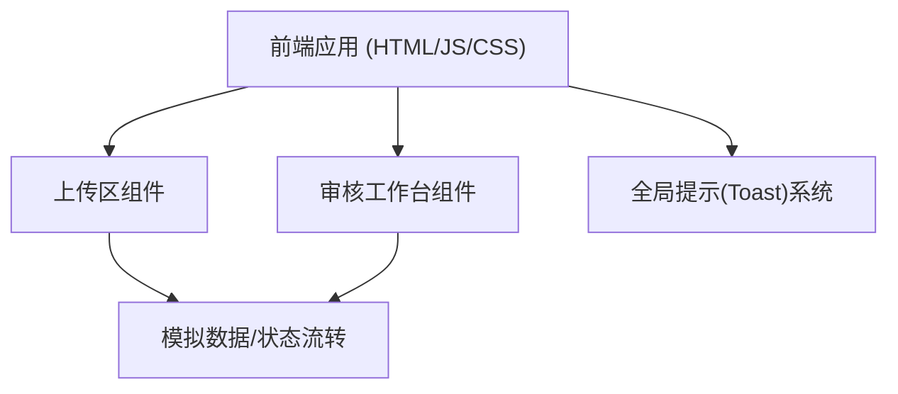

## 1. 架构设计


## 2. 技术说明
- 前端：原生 HTML5 + Tailwind CSS (通过 CDN 引入) + 原生 JavaScript
- 开发工具：无需构建工具，直接打开 `index.html` 即可运行体验。
- 图标库：可使用 Lucide 或 Heroicons 的 SVG，以提升专业感。

## 3. 路由定义
由于是单页面静态 Demo，无需复杂的路由配置。
| 路由 | 用途 |
|-------|---------|
| `index.html` | 包含上传区和审核工作台的主页面 |

## 4. 数据模型定义 (模拟)
```javascript
// 待审图片数据结构
const mockData = [
  {
    id: 1,
    thumbnailUrl: "https://images.unsplash.com/photo-1516214104703-d2507f01dda3?w=500&q=80",
    photographerId: "@alex_photo",
    uploadTime: "2026-05-07 10:23:45"
  },
  // ...
]
```
